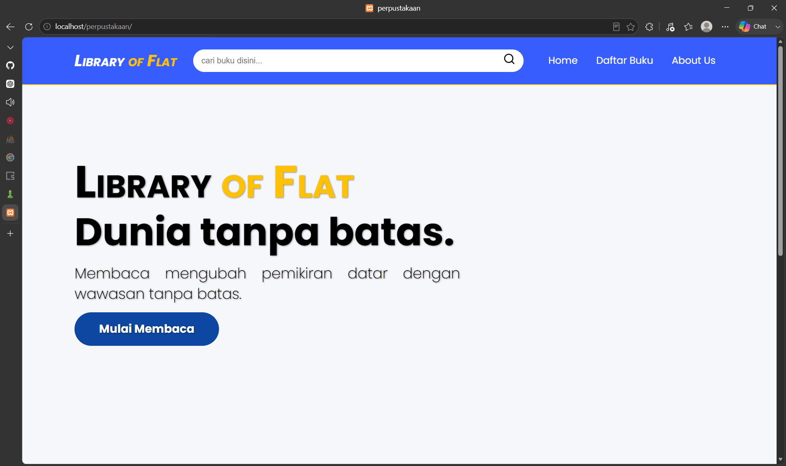
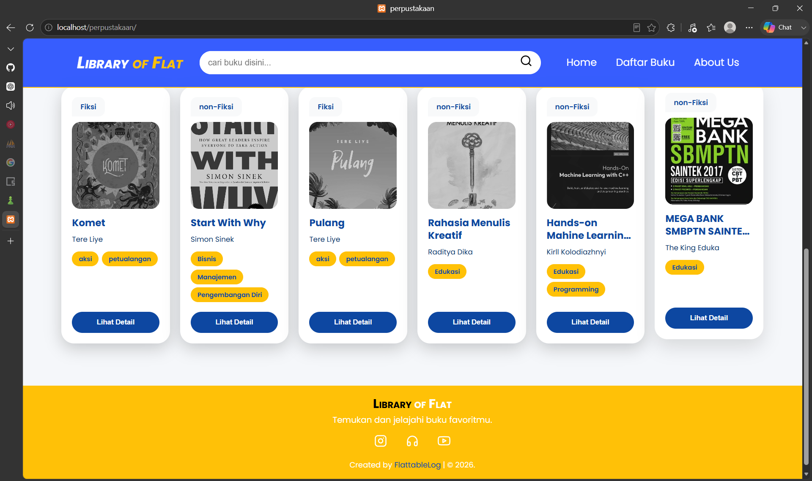
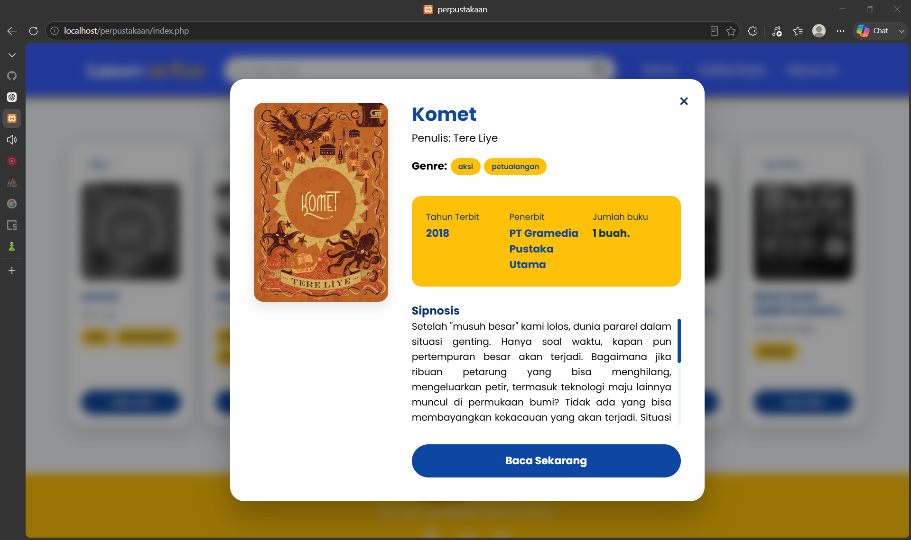
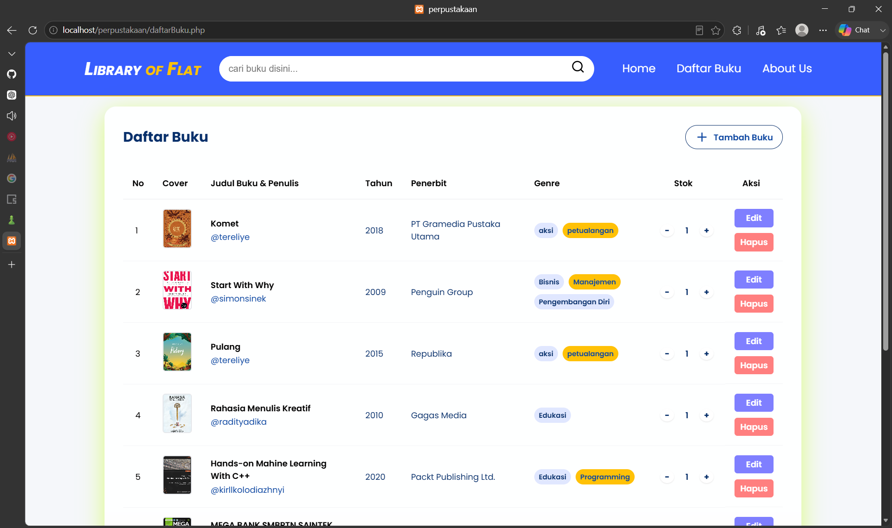
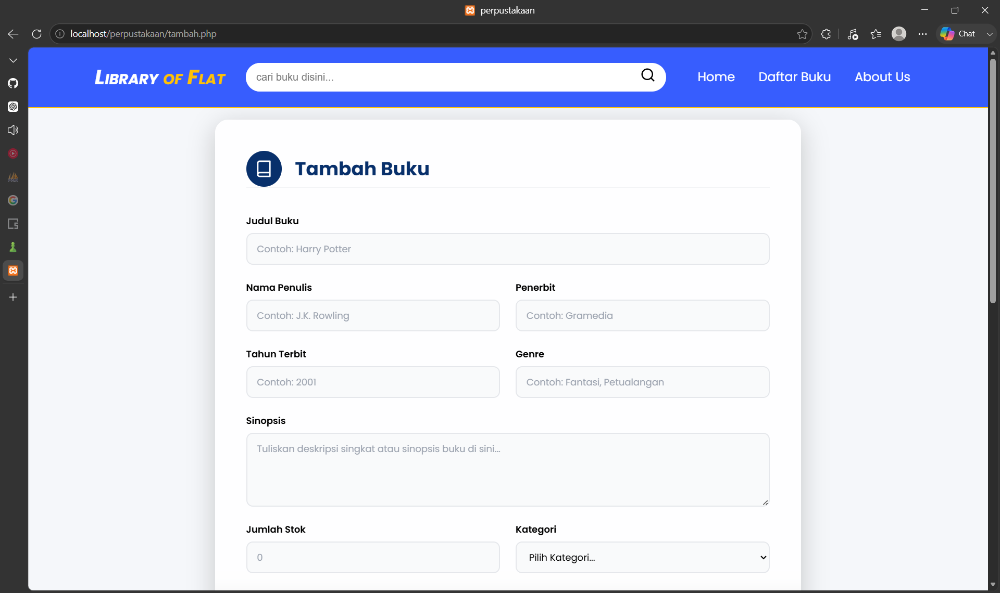
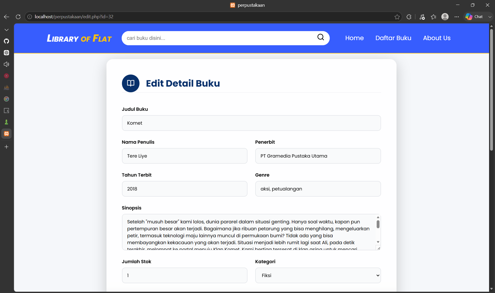
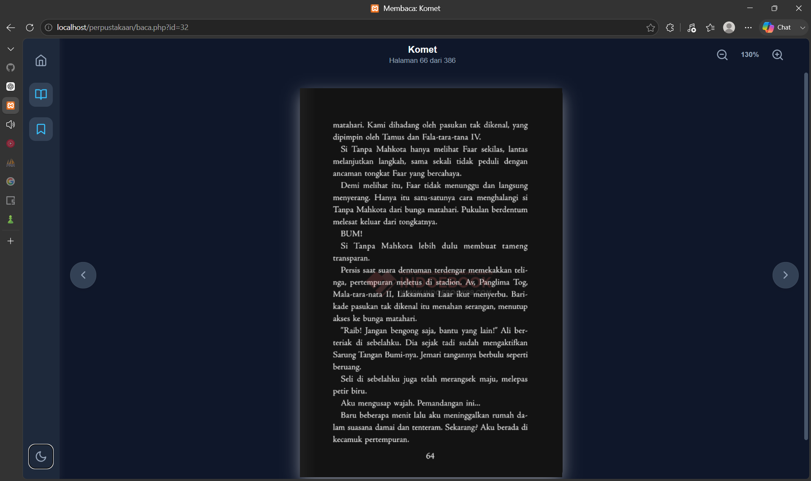

# 📚 Flat Library

> A simple web-based library management system built with **PHP Native** and **MySQL**.


---

## 📖 About

Flat Library is a web application developed to manage a digital book collection. It provides features for adding, editing, deleting, and reading books directly from the browser.

This project was built as a learning project using **PHP Native**, **MySQL**, **HTML**, **CSS**, and **JavaScript** without using any framework.

---

## ✨ Features

- 📚 Display book collection
- ➕ Add new books
- ✏️ Edit book information
- ❌ Delete books
- 📖 Read PDF books directly in browser
- 🖼 Upload book cover images
- 📝 Book synopsis
- 🏷 Category & Genre
- 📦 Book stock management

---

## 🛠 Built With

- PHP Native
- MySQL
- HTML5
- CSS3
- JavaScript
- XAMPP

---

## 📋 Requirements

- PHP 8.0 or later
- MySQL 5.7+
- Apache Server
- XAMPP (recommended)
- Modern Web Browser

## 📂 Project Structure

```text
Flat-Library/
│
├── asset/
│   ├── ebook/
│   ├── sampul/
│   └── ...
│
├── database/
│   └── perpustakaan.sql
│
├── layout/
├── style/
│
├── baca.php
├── daftarBuku.php
├── edit.php
├── hapus.php
├── index.php
├── jumlah.php
├── koneksi.php
├── tambah.php
│
└── README.md
```

---

## 🚀 Installation

### 1. Clone Repository

```bash
git clone https://github.com/FlattableLog/Flat-Library.git
```

### 2. Move Project

Move the cloned project into your XAMPP `htdocs` directory:

### 3. Import Database

Open **phpMyAdmin**

Create database:

```
perpustakaan
```

Import:

```
database/perpustakaan.sql
```

### 4. Configure Database


Open phpMyAdmin and create a new database named:

```php
$host = "localhost";
$user = "root";
$password = "";
$database = "perpustakaan";
```

### 5. Run

Start **Apache** and **MySQL** from XAMPP.

Open:

```
http://localhost/perpustakaan
```

---

## 📸 Screenshots

### Home Page
The main dashboard displaying featured books, quick navigation, and access to the digital library.



preview book recently added.


### Book Detail
Shows detailed information about the selected book, including cover image, synopsis, category, genre, stock, and other metadata before reading or downloading.


### Book List
Displays all available books in a clean list view. Users can browse, search, and select books to view more details.



### Add Book
Provides an administration form to add new books by uploading cover images, PDF files, and complete book information.



### Edit book
Allows administrators to update book information, replace book covers, update PDF files, and modify metadata efficiently.


### PDF Reader
Integrated PDF reader that enables users to read books directly from the browser without downloading the file.



## 🎯 Future Improvements

- Search books
- Pagination
- User authentication
- Admin dashboard
- Responsive mobile design
- Dark mode
- Book borrowing system
- Multi-user support

---

## 👨‍💻 Author

**Ahmad Hendra Adikurnia**

📷 Instagram: [@ahmdhndra__](https://instagram.com/ahmdhndra__)

---

## 💡 Key Learning Outcomes

During this project, I practiced:

- CRUD operations using PHP Native
- File upload handling (PDF & image)
- MySQL database design
- Dynamic data rendering
- Form validation
- Responsive UI with HTML & CSS
- Organizing a small-scale web application


## 📄 License

This project is intended for educational purposes.
